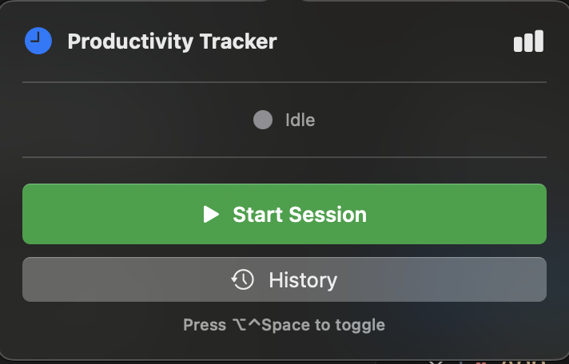
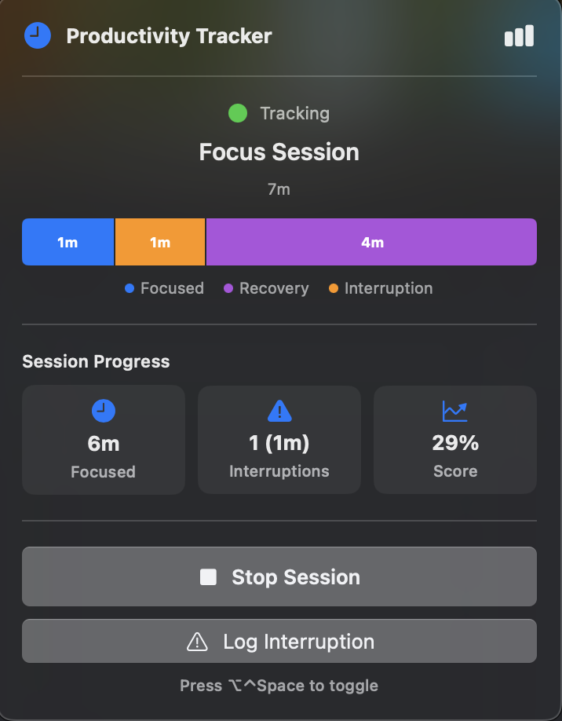
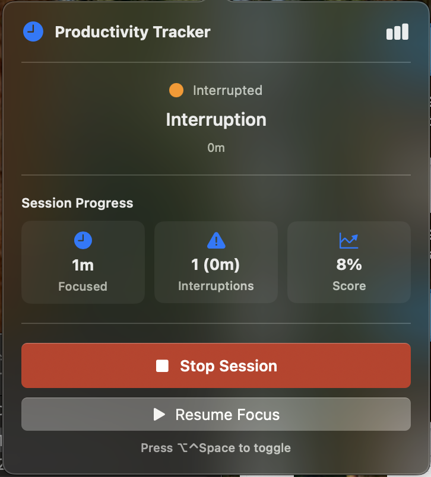
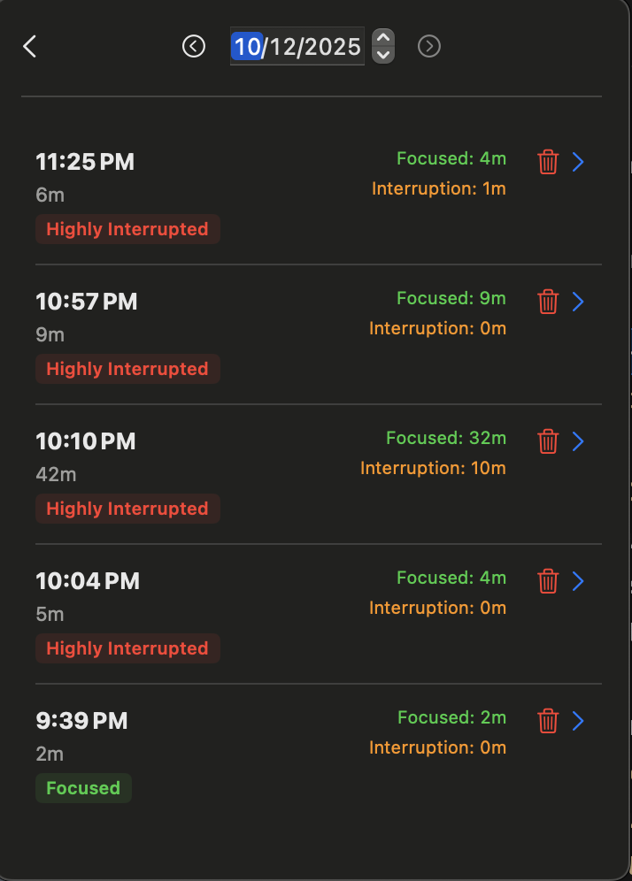
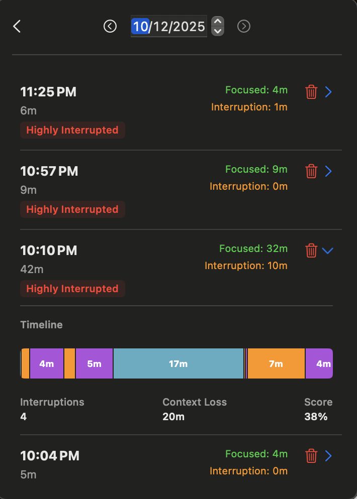

<a name="readme-top"></a>

<!-- PROJECT LOGO -->
<br />
<div align="center">
  <h3 align="center">Productivity Tracker</h3>

  <p align="center">
    A macOS menu bar app to track focus sessions, interruptions, and productivity metrics based on the mathematics of deep work.
  </p>
</div>

<details>
  <summary>Table of Contents</summary>
  <ol>
    <li>
      <a href="#about-the-project">About The Project</a>
      <ul>
        <li><a href="#the-logic-behind-the-app">The Logic Behind the App</a></li>
        <li><a href="#built-with">Built With</a></li>
      </ul>
    </li>
    <li>
      <a href="#getting-started">Getting Started</a>
      <ul>
        <li><a href="#prerequisites">Prerequisites</a></li>
        <li><a href="#installation">Installation</a></li>
      </ul>
    </li>
    <li><a href="#usage">Usage</a></li>
    <li><a href="#contributing">Contributing</a></li>
    <li><a href="#license">License</a></li>
  </ol>
</details>


<!-- ABOUT THE PROJECT -->
## About The Project

Productivity Tracker is a native macOS application designed to help knowledge workers understand and improve their focus. Unlike simple time trackers, this app focuses on the *quality* of your work time by explicitly tracking interruptions and their impact on your flow.

### The Logic Behind the App

The core philosophy of this application is based on the insights from the article [**"The Math of Why You Can't Focus at Work"**](https://justoffbyone.com/posts/math-of-why-you-cant-focus-at-work/).

The article models productivity using three critical variables that determine whether you have a good day or a bad day:

1.  **λ (Lambda) - Interruption Rate**: How often you are interrupted (e.g., Slack messages, meetings, shoulder taps).
2.  **Δ (Delta) - Recovery Time**: The time it takes your brain to switch context and get back into "flow" after an interruption.
3.  **θ (Theta) - Focus Threshold**: The minimum amount of uninterrupted time required to make meaningful progress on a complex task (e.g., 30 or 60 minutes).

**How Productivity Tracker helps:**

*   **Visualizes Fragmentation**: The app renders a timeline of your session. Green blocks represent focus, orange blocks represent interruptions, and purple blocks represent the "penalty" or recovery time lost.
*   **Real-time Metrics**: It calculates your "Session Progress" by accounting for the time lost to interruptions, giving you a realistic view of your actual productive time.
*   **Conscious Tracking**: By manually logging interruptions (via shortcuts or the menu), you become more aware of your **λ (Lambda)** and can take steps to reduce it.

<p align="right">(<a href="#readme-top">back to top</a>)</p>


### Built With

*   [![Swift][Swift-badge]][Swift-url]
*   [![SwiftUI][SwiftUI-badge]][SwiftUI-url]
*   **SwiftData** for local persistence.

<p align="right">(<a href="#readme-top">back to top</a>)</p>


<!-- GETTING STARTED -->
## Getting Started

To get a local copy up and running follow these simple steps.

### Prerequisites

*   macOS Sonoma (14.0) or later.
*   Xcode 15.0 or later (to build from source).

### Installation

1.  Clone the repo
    ```sh
    git clone https://github.com/your_username/productivity-tracker.git
    ```
2.  Open the project in Xcode
    ```sh
    cd productivity-tracker
    open ProductivityTracker.xcodeproj
    ```
3.  Build and Run (Cmd + R)

<p align="right">(<a href="#readme-top">back to top</a>)</p>


<!-- USAGE EXAMPLES -->
## Usage

The app lives in your macOS Menu Bar.

### Session Management

1.  **Start a Session**: Click "Start Session" or use the global shortcut (`Opt + Ctrl + Space`) to begin a focus block.

    

2.  **Track Progress**: View your current session status, including focus time and interruptions.

    

### Handling Interruptions

3.  **Log an Interruption**: When you are interrupted, press the shortcut again or click "Log Interruption". The timer will pause, and the app will track the duration of the interruption.

    

4.  **Resume Focus**: Once the interruption is handled, click "Resume Focus". The app will log the interruption and help you visualize the context switch.

### History & Analytics

5.  **Review History**: Open the History view to see a calendar of your past sessions and identify patterns in your productivity.

    

6.  **Detailed Insights**: Expand a session to see the timeline and detailed metrics including context loss.

    

<p align="right">(<a href="#readme-top">back to top</a>)</p>


<!-- CONTRIBUTING -->
## Contributing

Contributions are what make the open source community such an amazing place to learn, inspire, and create. Any contributions you make are **greatly appreciated**.

If you have a suggestion that would make this better, please fork the repo and create a pull request. You can also simply open an issue with the tag "enhancement".
Don't forget to give the project a star! Thanks again!

1.  Fork the Project
2.  Create your Feature Branch (`git checkout -b feature/AmazingFeature`)
3.  Commit your Changes (`git commit -m 'Add some AmazingFeature'`)
4.  Push to the Branch (`git push origin feature/AmazingFeature`)
5.  Open a Pull Request

<p align="right">(<a href="#readme-top">back to top</a>)</p>


<!-- LICENSE -->
## License

Distributed under the MIT License. See `LICENSE.txt` for more information.

<p align="right">(<a href="#readme-top">back to top</a>)</p>


<!-- MARKDOWN LINKS & IMAGES -->
<!-- https://www.markdownguide.org/basic-syntax/#reference-style-links -->
[Swift-badge]: https://img.shields.io/badge/Swift-FA7343?style=for-the-badge&logo=swift&logoColor=white
[Swift-url]: https://swift.org/
[SwiftUI-badge]: https://img.shields.io/badge/SwiftUI-000000?style=for-the-badge&logo=swift&logoColor=blue
[SwiftUI-url]: https://developer.apple.com/xcode/swiftui/

